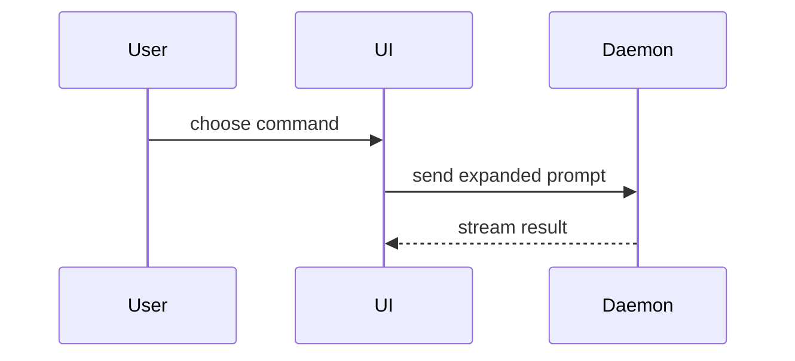

Use this template for the body:

```markdown
## Summary

<call tree, component tree, file tree, pseudocode, diff sketch, or Mermaid diagram>

## Evidence

- **Before:** <screenshot, output, or failing test run>
  **After:** <screenshot, output, or passing test run>

## Merge danger

**Door:** <one-way or two-way>

<optional: what makes it that>

**Blast radius:** <one-word scope>

<optional: what a bad merge reaches>
```

Everything here applies unchanged to a merge request on GitLab.

Skip preambles and keep prose brief. Write it in the language its primary source already uses, the ticket or specification the change came from, with the project's domain terms from `CONTEXT.md`.

## Summary

Why the change exists comes from its primary source. The diff decides which **shape** shows it, never what it was for.

Pick the smallest view that makes the key point clear.

- Logic or an algorithm, as pseudocode:

```text
on(save)
  if content is unchanged
    return cached result
  write new content
  return fresh result
```

- Runtime control flow, as a call tree:

```text
submitForm
  createSession
    persistPrompt
    launchAgent
  navigateToSession
```

- User interface structure, as a component tree, carrying the state and module boundaries that matter:

```text
<SessionPage>                 apps/example/src/routes/session.tsx
  useSessionEvents()
  <SessionToolbar>
    <RunSkillButton>          packages/ui
```

- File responsibility, or a broad refactor, as a shallow file tree:

```text
src/
├── commands/       # parses user actions
├── sessions/       # owns session state
└── transport/      # sends API requests
```

- Component interaction, control flow, or data flow, as a Mermaid diagram:



- A `diff` when the point is what changes and the surrounding shape already exists. Match the diff's shape to the topic.

For a component change:

```diff
 <SessionPage>
   useSessionEvents()
   <SessionToolbar>
+    <RunSkillButton />
   <SessionTimeline>
+    <SkillResultCard />
```

For a file-layout change:

```diff
 src/
 ├── commands/
+│   └── show-me.ts       # expands the slash command
 ├── sessions/
-└── transport.ts
+└── transport/
+    ├── client.ts
+    └── stream.ts
```

For a call-tree change:

```diff
 submitForm
   createSession
     persistPrompt
+    expandSkillMention
     launchAgent
-  navigateToSession
+  navigateToSession
+    subscribeToEvents
```

For a state or control-flow change:

```diff
 on(save)
-  write content
+  if content is unchanged
+    return cached result
+  write new content
+  invalidate cache
```

- The whole block, when most of it is new, when omitted context would hide ownership or order, or when the reviewer needs a copyable target shape:

```ts
function expandSkill(command: string): string {
  const skillName = command.slice(1);
  return `use the ${skillName} skill`;
}
```

Place each visual next to the short text it supports, and keep only the calls, files, props, states, and boundaries a reviewer needs to answer the question in front of them. One of these shapes is usual, several happen, all of them never does.

## Evidence

Concrete proof the change works, as a before and after pair.

A screenshot is the best evidence there is, wherever the change is visual and the environment can produce one. Execution comes next: a test run, console output, the exact test that went from failing to passing, sketched as pseudocode rather than pasted in full.

## Merge danger

**Door** is whether the merge is reversible. You walk back through a two-way door; a one-way door you do not. A change that is cheap to roll back is low risk, and one carrying a destructive action or a hard-to-reverse decision is not.

**Blast radius** is how far a bad merge reaches. Name it in one word, then say what it touches if the one word hides something: layout shift, breakage for consumers, mobile responsiveness, a migration that runs on deploy.
